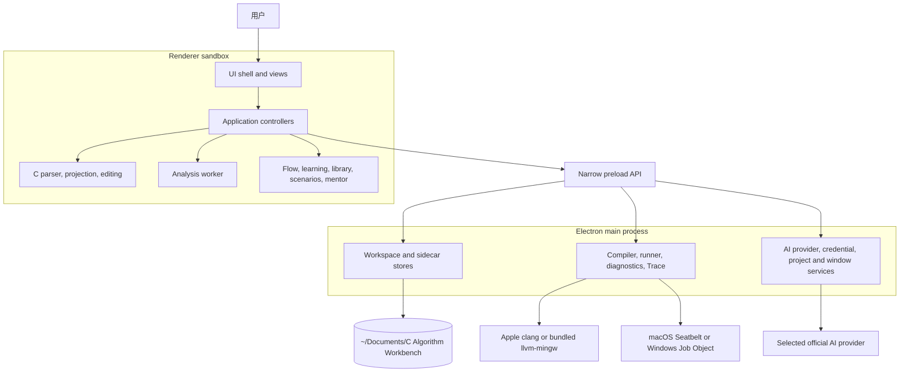
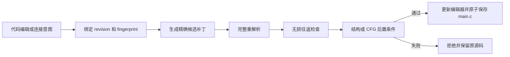

# 当前架构

本文描述当前 `main`（目标 `v0.0.3-preview.1`）的实际系统结构。它是可更新的架构总览，不替代
[ADR](./decisions/README.md)；已经 Accepted 的决策只能由新的 ADR 修订。

## 核心不变量

1. `main.c` 是唯一可执行事实源。
2. 画布、分析、课程、运行历史和 AI 对话都是可删除、可重建或可迁移的
   辅助数据。
3. 任何语义写入都必须绑定当前源码 revision 和 fingerprint，并经过候选
   补丁、重解析、无损往返及所需后置条件。
4. 不确定的 C 结构保留为原始文本或 partial 投影；系统不会为了得到漂亮的
   图而猜测语义。
5. renderer 不拥有任意文件系统、原生进程、明文凭据或通用网络能力。
6. 实测、静态推断、教学模拟和启发式建议是不同的证据类型。

## 系统地图



应用是一个本地模块化单体。进程隔离用于保护操作系统能力边界，不把业务
模块拆成网络服务。

## 运行时边界

### Renderer

主窗口和 AI 子窗口均启用 `contextIsolation`、禁用 `nodeIntegration`、启用
Electron sandbox 和 `webSecurity`。窗口拒绝新开页面和非受信导航。

Renderer 负责：

- 工作台 UI、自由画布、代码编辑器、Library、教程和分析可视化；
- 在浏览器 Worker 中按函数生成 CFG 和其他只读分析；
- 生成连接意图、源码补丁计划和运行请求；
- 根据 fingerprint 丢弃过期的分析、Trace 和 AI 结果。

Renderer 不直接读取路径、写文件、启动进程、解密密钥或访问 AI Endpoint。

### Preload

`electron/preload/index.ts` 和 `electron/preload/ai-window.ts` 是窄桥接层。它们
只暴露具名方法，并在数据进入 renderer 前复制或验证公共结果。

API 按能力分组：

- 应用与语言：公开版本信息、系统语言和本地界面语言；
- 工作区：列表、新建、打开、保存和版本化 sidecar；
- 执行：capabilities、compile、run、diagnose 和 Trace；
- 学习：自定义积木目录；
- AI：Provider 配置、模型列表、导师请求、项目和对话；
- 窗口：打开 AI 子窗口并交换受限状态和意图。

Preload 不暴露通用 `send`、`on`、`readFile`、路径或解密接口。

### Electron 主进程

主进程是可信能力的组合根：

- `workspace-store.ts` 和 `workspace-sidecar-store.ts` 管理 Documents 中的
  原子文件写入、revision 冲突、大小限制和符号链接拒绝；
- `runner/` 管理平台工具链探测、编译制品、进程树、资源限制、macOS
  Seatbelt、Windows Job Object、诊断和有界 Trace；
- `ai-provider-*` 固定官方主机、验证模型响应，并使用 `safeStorage` 保存密钥；
- `ai-project-store.ts` 管理每个托管工作区的版本化多对话记录；
- `ai-window-*` 管理单独的 AI BrowserWindow 和窗口所有权。

每个 IPC handler 都验证发送窗口和请求结构。窗口关闭会先触发 renderer
保存握手，再清理 Trace、runner 制品和 AI 请求。

## 代码层次

| 路径                | 职责                                         | 允许的关键依赖                     |
| ------------------- | -------------------------------------------- | ---------------------------------- |
| `src/shared/`       | IPC DTO、限制、验证器和跨进程纯契约          | 无 DOM、无 Electron 主进程实现     |
| `src/core/`         | C 解析、无损投影、符号、受控文本补丁         | 纯 TypeScript 与解析器契约         |
| `src/analysis/`     | CFG、def-use、到达定义、循环、数组、内存事实 | 只读 core 模型；禁止 core 写路径   |
| `src/flow/`         | 流程投影、端口、边、连接意图和视图状态       | 只读 core/analysis/shared 事实     |
| `src/learning/`     | 版本化预设、模板和生命周期                   | 纯目录与验证逻辑                   |
| `src/library/`      | 词条、搜索、别名和双语本地化                 | 纯目录数据                         |
| `src/tutorials/`    | 课程定义、任务状态和证据要求                 | 纯课程状态机                       |
| `src/runtime/`      | 运行历史、比较资格和证据分析                 | shared 运行结果                    |
| `src/mentor/`       | 确定性本地提示和案例 Provider                | 分析与运行证据                     |
| `src/workbench/`    | 内置模块注册表和贡献契约                     | 仅 workbench/shared                |
| `src/app/`          | 跨域控制器、生命周期和一致性协调             | 组合 domain、UI 和 Panel API       |
| `src/ui/`           | DOM 视图、交互和无障碍状态                   | app/domain 公共接口                |
| `src/renderer/`     | parser 启动和 renderer bootstrap             | app、core 与 UI                    |
| `electron/preload/` | 具名 IPC 桥                                  | shared 契约与 Electron preload API |
| `electron/main/`    | 文件、进程、网络、凭据和原生窗口             | shared 契约与 Node/Electron        |

`src/main.ts` 只负责 renderer 组合和会话连接，具体功能继续下沉到 `src/app/`
控制器。架构门禁将它限制在 500 行以内。

## 数据所有权

托管根目录位于用户 Documents：macOS 通常为
`~/Documents/C Algorithm Workbench/`，Windows 通常为
`%USERPROFILE%\Documents\C Algorithm Workbench\`。其内部结构一致：

```text
<Documents>/C Algorithm Workbench/<Kind>/<opaque-id>/
├── entry.json
├── main.c
├── flow-view.json          optional
├── scenarios.json          optional
├── run-history.json        optional
├── tutorial-progress.json  optional
└── ai-project.json         optional
```

| 数据                     | 权威程度                        | 失败行为                         |
| ------------------------ | ------------------------------- | -------------------------------- |
| `main.c`                 | 唯一可执行事实源                | 保存冲突时拒绝覆盖并要求显式恢复 |
| `entry.json`             | 条目身份、标题和磁盘 revision   | 无效条目不会作为项目打开         |
| `flow-view.json`         | 坐标、视口、草稿、锚点和布局    | 损坏或歧义时只重置对应视图状态   |
| `scenarios.json`         | 输入、期望输出、分支目标和规模  | 失效案例不能成为运行证据         |
| `run-history.json`       | 有界的真实运行与 Benchmark 摘要 | 损坏时丢弃历史，不影响源码       |
| `tutorial-progress.json` | 课程任务、证据和检查点          | 不一致时重置课程，不覆盖源码     |
| `ai-project.json`        | 项目级对话和源码证据绑定        | 损坏或删除时只丢失对话           |

Renderer 只看到 opaque workspace ID，不看到托管目录的绝对路径。主进程使用
同目录临时文件、刷盘和原子替换更新持久化数据。

## 关键写入路径

### 源码与画布



移动节点只改变 `flow-view.json`。从预设拖入但尚未合法接入的节点是草稿，
不参与编译。数据依赖线来自 def-use 推导并保持只读。

### 运行与 Trace

普通运行把当前 source snapshot 发送给主进程。主进程先检查工具链和运行
边界，再创建短期编译制品并在受限进程树中运行。macOS 使用已验证的 Apple
clang 与 Seatbelt；Windows 10/11 x64 使用随包分发、摘要锁定的 llvm-mingw，
并通过 `algolatch-job-host.exe` 把子进程放入 Windows Job Object。关键运行
能力不可用时执行会 fail closed，或在受支持的 trusted-only 路径中要求用户
对该次请求明确授权。

Windows Job Object 限制进程数、聚合内存和 CPU 时间，并在宿主关闭时回收
进程树，但不提供文件系统或网络隔离。它是资源与生命周期边界，不是任意
原生代码沙箱。

Trace 使用临时影子源码，不修改项目目录。session 绑定窗口、源码指纹、
一次性授权和资源限制；renderer 通过序号批量拉取事件。达到 10,000 条事件、
8 MiB、取消、窗口关闭或源码变化时，旧轨迹停止或失效。

### AI 请求与源码修改

Provider 密钥只存在于主进程的加密配置存储中。Endpoint 由注册表固定，
renderer 不能提交任意 URL。每个窗口最多有一个活动 AI 请求，取消、超时、
畸形响应和源码变化都会使结果 fail closed。

AI 默认只读。用户显式开启修改权限后，模型仍不能直接写文件：它返回受限
替换提案，renderer 生成 diff 和检查点，再复用正常源码写入门禁。全文源码
只会在用户选择对应模式后进入该次请求。

## 扩展模型

`src/workbench/` 提供版本化的内置贡献契约，可注册：

- Dock 菜单与分支；
- 页面、面板和布局预设；
- 命令和检查器视图；
- 算法元素描述。

`src/learning/` 的 `PresetBlockDefinition` 独立负责源码积木、端口、放置规则、
解释、案例、替代版本和生命周期。现阶段只加载随应用编译的内置模块，不是
可下载第三方代码的插件平台。

新增扩展不能获得新的源码写入通道。需要文件、进程、网络或凭据能力时，
必须先定义窄 shared 契约、主进程验证和对应 ADR 或安全说明。

## 架构适应度函数

以下门禁验证实际依赖方向，而不是只依赖本文：

- `dependency-cruiser` 拒绝循环、未解析导入和跨进程反向依赖；
- TypeScript 源码扫描在 `import type` 被擦除前检查同一边界；
- `src/core/` 不能依赖 analysis 或 workbench；
- `src/analysis/` 不能依赖 core 的 editing、emitter 或 patch 写路径；
- `src/flow/` 不能依赖 UI、Electron、workbench 或任何源码写路径；
- `src/workbench/` 只能依赖自身和 shared；
- preload 不能导入 main，renderer 不能导入 Electron 实现；
- `src/main.ts` 保持不超过 500 行。

运行门禁：

```sh
npm run typecheck
npm run deps:check
npm run test:unit
npm run build
```

发布还需要 M0–M9 回归、Electron E2E，以及 macOS DMG 与 Windows NSIS 的
平台签名和安装态验证。完整命令见
[CONTRIBUTING.md](../../CONTRIBUTING.md)。

## 当前约束

- 支持 macOS Universal 与 Windows 10/11 x64；仍只支持单个 `main.c`。
- 自由画布是 C 的投影，不是独立通用图语言。
- 宏、`goto`、解析恢复和 partial CFG 会降低可安全编辑的范围。
- Trace 提供执行行与分支路径，不采集任意变量值。
- 静态分析是保守事实和提示，不是完整形式化证明。
- AI 是可选外部服务；回答和提案不能替代编译、测试或源码门禁。
- `v0.0.1` 是改名前的历史未签名包。macOS 正式通道强制 Developer ID、
  Hardened Runtime、固定最小 entitlements、公证、staple 与 quarantine 后
  Gatekeeper 检查；Windows 正式通道强制 Authenticode 与 NSIS 安装态回归。
  两个平台可以独立发布，但不得互相替代门禁；联合 Release 必须同时满足两套
  门禁。明确标记的 unsigned prerelease 使用独立资产和校验清单。Windows Job
  Object 不提供文件或网络隔离。

## 决策记录

- [ADR-0001：版本化本地工作台模块](./decisions/0001-versioned-workbench-modules.md)
- [ADR-0002：Documents 托管工作区](./decisions/0002-managed-documents-workspace.md)
- [ADR-0003：源码权威的自由流程投影](./decisions/0003-source-authoritative-flow-projection.md)
- [ADR-0004：有界影子源码 Trace](./decisions/0004-bounded-shadow-trace.md)
- [ADR-0005：实测效率与复杂度结论分离](./decisions/0005-evidence-separated-efficiency.md)
- [ADR-0006：项目级 AI 对话与显式授权写入](./decisions/0006-project-scoped-ai-conversations-and-gated-writes.md)
- [ADR-0007：Windows 内置运行时与安装包边界](./decisions/0007-windows-runtime-and-installer.md)
